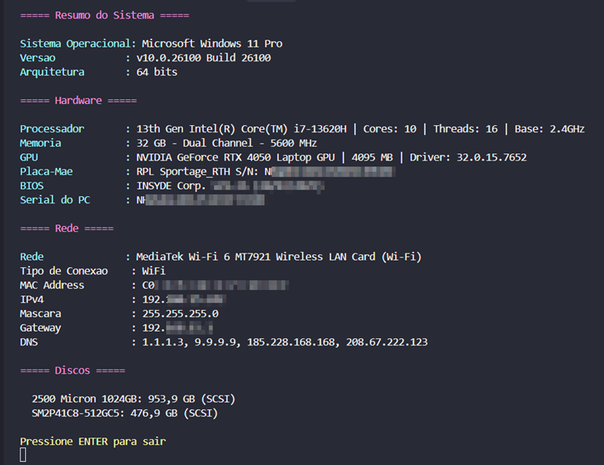

# 🔍 System Information Tool

[](https://docs.microsoft.com/en-us/powershell/)
[](https://www.microsoft.com/windows)
[](LICENSE)
[](https://www.linkedin.com/in/isaaclacerda/)

## 📋 Sobre

Script PowerShell avançado que coleta e exibe informações detalhadas sobre hardware, software, rede e armazenamento do Windows. Desenvolvido para técnicos de TI, administradores de sistema e profissionais que necessitam de relatórios rápidos, organizados e visualmente atrativos das especificações do sistema.

### 🎯 **Objetivo**

>Facilitar a obtenção de informações do sistema via terminal, auxiliando na busca por drivers pós-instalação e identificação de componentes. Substitui a necessidade de navegar por múltiplas ferramentas do Windows ou usar comandos complexos do PowerShell.

## ✨ Características

- **🎨 Interface Visual**: Loading animado e formatação colorida profissional
- **📊 Informações Completas**: CPU, RAM, GPU, placa-mãe, rede, discos
- **⚡ Execução Rápida**: Resultados em segundos
- **🔧 Zero Dependências**: Funciona apenas com PowerShell nativo
- **🛡️ Seguro**: Não coleta dados pessoais ou sensíveis
- **📄 Exportação CSV**: Gera relatórios em formato CSV para análise posterior
- **📁 Organizado**: Arquivos CSV salvos automaticamente na área de trabalho
- **🔤 Padronização**: Todos os dados em maiúsculo para consistência
- **🌐 Rede Detalhada**: Informações completas de interfaces de rede
- **🗄️ Compatível com BD**: Formato ideal para inserção em bancos de dados

## 🛠️ Tecnologias

- **PowerShell 5.1+** - Linguagem de script e automação
- **WMI/CIM** - Windows Management Instrumentation para coleta de dados
- **Windows 10/11** - Sistema operacional suportado
- **CSV Generation** - Geração manual para controle total de codificação
- **Database Integration** - Formato otimizado para bancos de dados
- **Character Encoding** - Suporte a múltiplas codificações

## 🚀 Como Usar

### Pré-requisitos
- Windows 10/11
- PowerShell 5.1+
- Permissões de administrador (recomendado)

### Configuração da Política de Execução
Para executar scripts PowerShell, pode ser necessário configurar a política de execução:
```powershell
Set-ExecutionPolicy -ExecutionPolicy RemoteSigned -Scope CurrentUser
```

### Instalação

#### Opção 1: Download e Execução Local
1. Baixe o arquivo `Get-SystemInfo.ps1`
2. Abra o PowerShell como administrador
3. Execute: `.\Get-SystemInfo.ps1`

#### Opção 2: Download ZIP
1. Clique em "Code" → "Download ZIP"
2. Extraia e duplo clique no `Get-SystemInfo.ps1`

#### Opção 3: Download Direto
```powershell
Invoke-WebRequest -Uri "https://raw.githubusercontent.com/isaacoolibama/system-info-tool/main/Get-SystemInfo.ps1" -OutFile "Get-SystemInfo.ps1"
```

### Execução

#### Método 1: Via PowerShell (Recomendado)
```powershell
.\Get-SystemInfo.ps1
```

#### Método 2: Com Política de Execução
```powershell
powershell -ExecutionPolicy Bypass -File "Get-SystemInfo.ps1"
```

#### Método 3: Execução Remota (Sem Download)

**Para Windows (PowerShell):**
```powershell
Invoke-Expression (Invoke-WebRequest -Uri "https://raw.githubusercontent.com/isaacoolibama/system-info-tool/main/Get-SystemInfo.ps1" -UseBasicParsing).Content
```

**Para Linux (Terminal Bash):**
```bash
curl -sL https://raw.githubusercontent.com/isaacoolibama/system-info-tool/main/system-info.sh | bash
```

## 📊 Informações Coletadas

### 🖥️ Sistema
- **Sistema Operacional**: Nome e versão do Windows
- **Build Number**: Número específico da build
- **Arquitetura**: x64, x86 ou ARM64

### 🔧 Hardware
- **Processador**: Modelo, cores, threads, frequências
- **Memória RAM**: Capacidade, configuração de canais, velocidades
- **Placa de Vídeo**: Modelo, memória dedicada, driver
- **Placa-mãe**: Fabricante e modelo
- **BIOS**: Versão e data de lançamento

### 🌐 Rede
- **Adaptadores**: Todas as interfaces de rede ativas
- **Tipos de Conexão**: WiFi, Ethernet, Virtual, Bluetooth
- **Endereços MAC**: Formatados com separadores
- **Configuração IP**: IPv4, IPv6, máscara, gateway
- **DNS**: Servidores DNS configurados
- **Status**: Ativo/Inativo de cada interface

### 💾 Armazenamento
- **Discos**: Modelo, capacidade, tipo de interface

## 📄 Exportação CSV

Após exibir as informações do sistema, o script oferece a opção de gerar um arquivo CSV com todos os dados coletados:

### 📁 Localização do Arquivo
- **Pasta**: Área de trabalho do usuário
- **Nome**: `SystemInfo_YYYYMMDD_HHMMSS.csv`
- **Formato**: ANSI com separadores de vírgula
- **Codificação**: Otimizada para máxima compatibilidade com Excel e outros editores

### 📊 Estrutura do CSV
O arquivo CSV contém as seguintes colunas:
- **CATEGORIA**: Tipo de informação (SISTEMA OPERACIONAL, HARDWARE, REDE, etc.)
- **CAMPO**: Nome específico do campo (todos em maiúsculo)
- **VALOR**: Dados coletados do sistema (padronizados em maiúsculo)


## 🎨 Exemplo de Saída



*Saída colorida e organizada com todas as informações do sistema*

## 📝 Licença

MIT License - veja [LICENSE](LICENSE) para detalhes.


<div align="center">

**Desenvolvido por Isaac Oolibama R. Lacerda**

[](https://www.linkedin.com/in/isaaclacerda/)

*Para a comunidade de TI*

</div> 